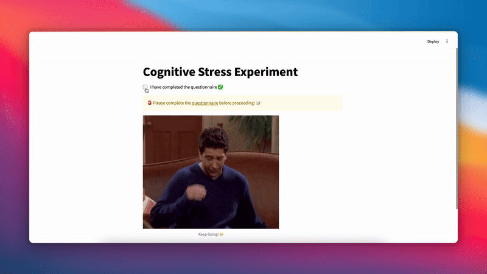

# Stress Detection System 🧑🏻‍💻

This project combines gaze tracking using a webcam and different types of tasks to assess cognitive behaviors and stress levels. It utilizes OpenCV for gaze tracking, Streamlit for the web interface, and logging for data collection and analysis.



---

## 📜 Features
- **Time-Constrained Task**: Perform tasks within a set time limit.  
- **Interruption Task**: Manage tasks with interruptions.  
- **Combination Task**: A mix of tasks to challenge cognitive ability.  
- **Behavior Tracking**: Tracks gaze, keystrokes, and mouse activity.  
- **Feedback Collection**: Gather user input on stress levels after completing tasks.
- **Data Logging**: Logs gaze data and task performance for analysis.

---

## 🛠️ Installation and Setup

### Prerequisites
Ensure you have the following installed:
- Python 3.7 or higher
- Pip (Python package manager)
- <a link='http://dlib.net/files/shape_predictor_68_face_landmarks.dat.bz2'>shape_predictor_68_face_landmarks.dat </a>
- <a link ='https://cmake.org/download/'> Cmake </a>
### Installation Steps
1. Clone this repository:
   ```bash
   1. Install required Python dependencies:
     pip install -r requirements.txt

   2. Download :shape_predictor_68_face_landmarks.dat in tasks/

   3. Download Cmake

   4. Setup a Virtual Env:
      python -m venv venv  
      source venv/bin/activate  
🚀 Usage

	1.Run the Time-Constrained Task:
    Launch the Streamlit app: streamlit run time_task.py

	2.Interact with the Application:
	•Complete the time-constrained tasks.
	•View feedback on your performance.
	•Optionally provide stress-level feedback.

🗂️ Project Structure

gaze-tracking-time-task/
├── data                        -> Directory to store logs 
├── tasks / time_constraint.py    -> Time-constrained script
├── app.py->  Streamlit App Entry Point 
├── requirements.txt         -> Python dependencies
└── README.md-> Project documentation

📊 Output

Example Logs

Gaze tracking logs and task performance data are saved in the data directory:
	•	Gaze Tracking Logs: Eye coordinates and gaze direction.
	•	Task Results: User inputs, correctness, and feedback.

✨ Contributions

Contributions are welcome! Feel free to open issues or submit pull requests.

🌟 Acknowledgments
	•	OpenCV for image processing
	•	Streamlit for interactive interfaces

🤝 License
This project is licensed under the MIT License. See LICENSE for more information.
